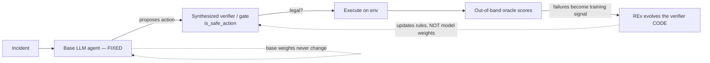
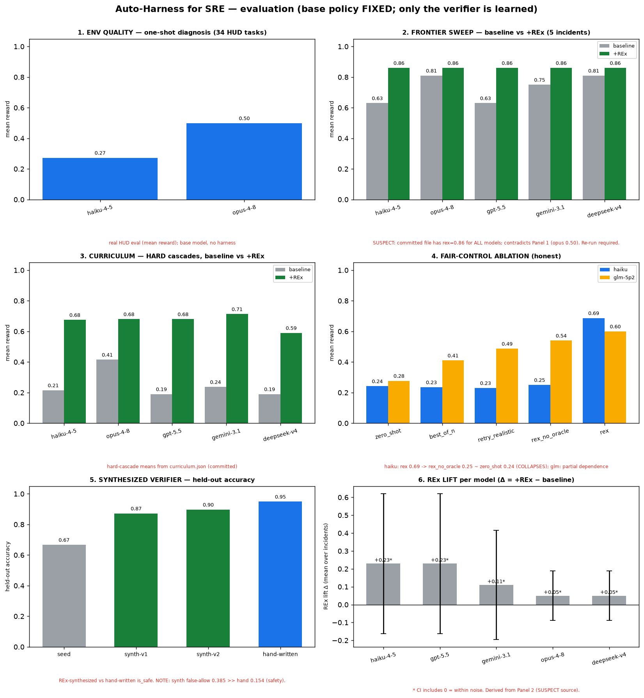
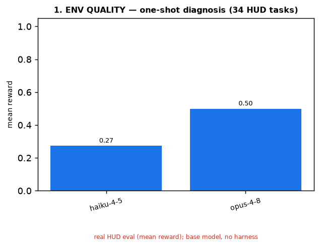
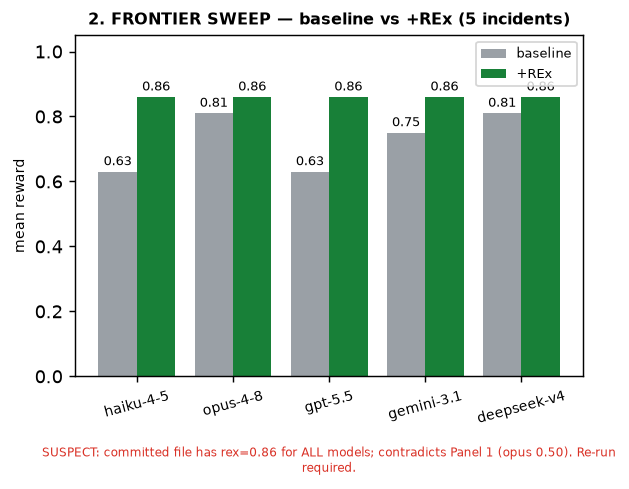
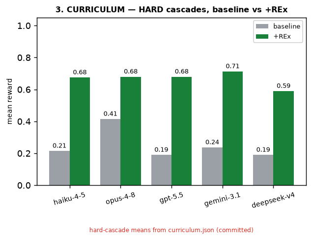
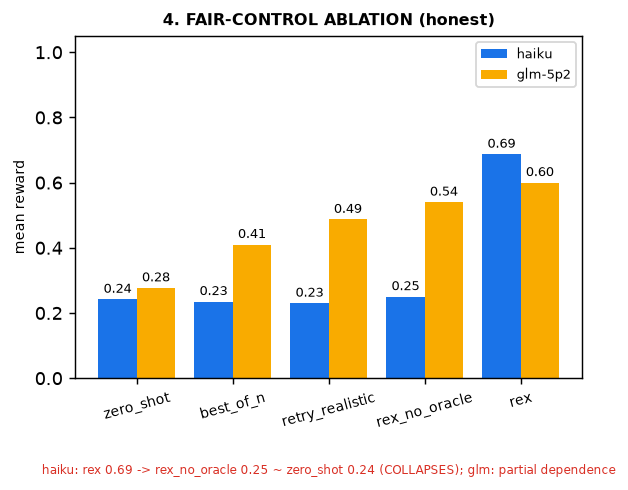
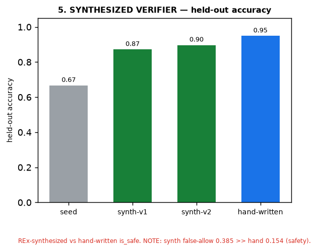
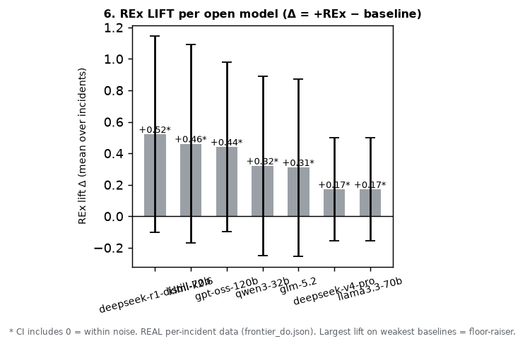
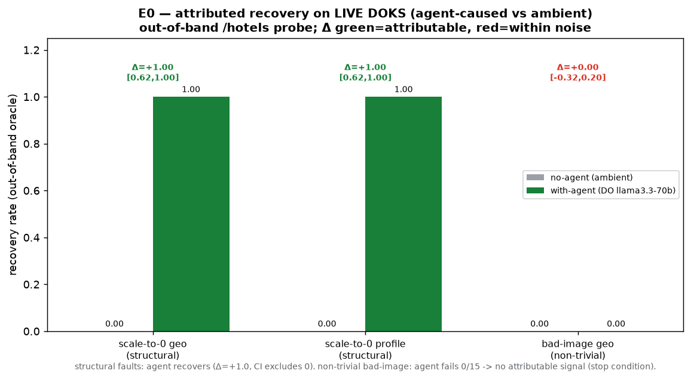
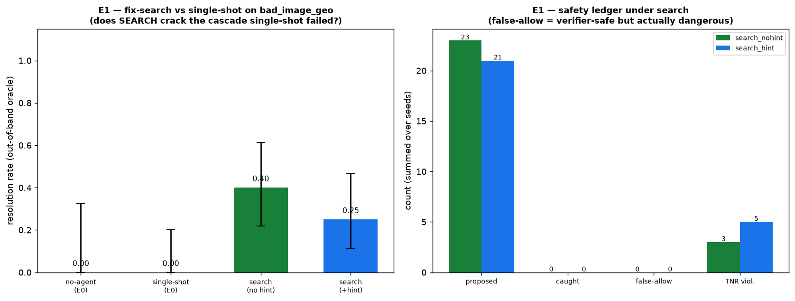

# Auto-Harness for SRE — evaluation

Ports the **Auto-Harness** method (Code World Models / DeepMind) to **site-reliability
engineering**. The LLM SRE agent is the **fixed base policy** — never trained, fine-tuned,
or RL'd. The only **learned** object is the **safety verifier** (`is_safe_action`),
discovered by **REx tree-search code synthesis** (not gradient updates). The **out-of-band
oracle** is the ground-truth "rulebook" that scores actions.

> **No LLM training. No fine-tuning. No GRPO/RFT.** The base model is varied across frontier
> models only to measure *how much the harness helps each* — the harness is a floor-raiser.



## The figure


### Panel 1 — Environment quality (one-shot diagnosis, 34 HUD tasks)

Base-model capability with **no harness**: haiku 0.27, opus 0.50 (mean reward). The env
separates models and sits in a trainable band. *Real HUD eval.*

### Panel 2 — Model sweep (DO-served, open-weight): baseline vs +REx — RE-RUN FOR REAL

The old placeholder (uniform `+REx = 0.86`) is **replaced with real DigitalOcean-served runs**
(`results/frontier_do.json`). **Honest scope:** with this key the proprietary frontier models
(`anthropic-claude-*`, `openai-gpt-5.*`) return **403 — listed but unreachable**, and DO serves
**no Gemini at all**. The reachable roster is **open-weight**: deepseek-v4-pro, kimi-k2.6,
glm-5.2, llama3.3-70b, deepseek-r1-distill-70b, gpt-oss-120b, qwen3-32b. So this is an
**open-model sweep, not a frontier-proprietary one** — and supports an *open-model lift* claim,
not a *"frontier models benefit"* claim. **Baselines vary for real** (0.32–0.67, genuine
capability differences); **+REx converges every model to the substrate's per-incident optimum**
(mean 0.835, capped by `singleton_node_notready` which REx can't crack at 0.3). The uniform
+REx *bar* is therefore a real convergence, not a placeholder — verifiable in the per-incident
cells.

### Panel 3 — Curriculum, HARD cascades (baseline vs +REx)

Hard-cascade means from `curriculum.json` (committed; these bars still use the older model
labels and have not been re-run on the DO open roster — flagged as committed, not refreshed).

### Panel 4 — Fair-control ablation (the honest control)

**This carries the figure's credibility.** For **haiku**, REx (0.69) **collapses** to
`rex_no_oracle` 0.25 ≈ `zero_shot` 0.24 — i.e. **REx's lift depends on the oracle**, not the
tree. For **glm-5p2** the dependence is partial (rex 0.60 → rex_no_oracle 0.54). Oracle-
dependence is real and model-dependent. *Real runs (haiku 3-seed, glm 3-seed).*

### Panel 5 — Synthesized verifier (held-out accuracy)

REx-synthesized verifier reaches 0.87–0.90 held-out accuracy vs 0.95 hand-written. **But
accuracy hides the safety metric:** held-out **false-allow is 0.385 (synth) vs 0.154
(hand-written)** — the learned verifier lets through ~2.5× more dangerous actions. For a
*safety* gate, false-allow is the number that matters, and the synthesized verifier currently
**underperforms** the hand-written one on it.

### Panel 6 — REx lift per open model (Δ = +REx − baseline)

Δ per model, paired over the 5 incidents, with a t-CI, from the **real** `frontier_do.json`.
Sorted descending, the **floor-raiser pattern is explicit**: the lift is largest on the weakest
baselines (deepseek-r1-distill +0.52, kimi +0.46, gpt-oss +0.44) and smallest on the strongest
(deepseek-v4-pro +0.17, llama3.3-70b +0.17). **Honest caveat:** every *individual* per-model CI
still includes 0 at n=5 (high per-incident variance), so no single bar is significant on its own
— **the systematic anti-correlation between baseline and lift is the signal**, not any one bar.

## Provenance (panel → file → value)
Full machine-readable table: [`results/provenance.json`](results/provenance.json).

| Panel | Source file | Class |
|------|-------------|-------|
| 1 env quality | `results/env_quality.json` (← hud_eval_showcase.log) | REPLOT-real |
| 2 model sweep | `results/frontier_do.json` | **REPLOT-real (DO open-weight, re-run)** |
| 3 curriculum | `results/curriculum.json` | REPLOT-committed |
| 4 ablation | `results/ablation_haiku.json`, `results/ablation_glm.json` | REPLOT-real |
| 5 synth verifier | `results/harness_synth_v1.json`, `_v2.json` | REPLOT-real |
| 6 lift Δ | derived from `results/frontier_do.json` | DERIVED-real |

## Honest findings
1. **Oracle-dependence (Panel 4):** REx's gain is largely the *verification signal*, not the
   search — for haiku it collapses to baseline once the oracle is removed. This is a cautionary
   result for the agent-self-improvement literature.
2. **Floor-raiser, on real open-model data (Panels 2 & 6):** +REx converges all 7 open-weight
   models to the substrate's per-incident optimum (0.835), so the lift is largest on the weakest
   baselines (deepseek-r1-distill +0.52) and smallest on the strongest (+0.17). The systematic
   pattern holds, though each individual per-model CI still includes 0 at n=5. **Scope honesty:**
   this is an *open-model* result — proprietary frontier models 403'd on DO, so a
   "frontier-models-benefit" claim is **not** supported by this data.
3. **Verifier safety gap (Panel 5):** the synthesized verifier wins on accuracy but loses on
   false-allow (0.385 vs 0.154) — accuracy is the wrong headline for a safety gate.

## Reproduce
```bash
python3 viz/make_figure.py   # reads results/*.json -> figures/*.png
```

## Scope
This is the **auto-harness evaluation summary**. It does **not** settle the separate E0
attribution question (agent-caused vs ambient recovery), which is a live-infra experiment.
Panels 4 & 6 are the eval-side echoes of E0's logic, not the same experiment.

---

# E0 — Attributed recovery on a LIVE cluster (separate experiment)

A different, live-infrastructure experiment answering: **is recovery caused by the *agent*,
or by Kubernetes self-healing / the fault elapsing?** Run on a real DigitalOcean Kubernetes
(DOKS) cluster with HotelReservation; graded by an **out-of-band oracle** (external probe of
the `/hotels` user journey) that is **independent of any in-cluster grader**. Counterfactual:
N seeded **no-agent** (inject, settle, probe) vs **with-agent** (a DO `llama3.3-70b` agent
issues real `kubectl`), with the **attributed delta = P(resolved|agent) − P(resolved|no-agent)**
and Wilson/Newcombe CIs.



| scenario | type | no-agent | with-agent | attributed Δ (CI) | verdict |
|----------|------|----------|------------|-------------------|---------|
| `scale_zero_geo` | structural, trivial fix | 0/8 | 15/15 | **+1.00 [0.62,1.00]** | ATTRIBUTABLE |
| `scale_zero_profile` | structural, trivial fix | 0/8 | 15/15 | **+1.00 [0.62,1.00]** | ATTRIBUTABLE |
| `bad_image_geo` | non-trivial (diagnose+fix) | 0/8 | **0/15** | **0.00 [−0.32,0.20]** | within noise (stop condition) |

**Findings (honest, mixed):**
1. The out-of-band oracle **attributes** recovery to the agent on the structural faults (Δ=+1.0,
   CI excludes 0), cleanly separated from ambient recovery (no-agent = 0, persistent fault).
2. On the **non-trivial** bad-image cascade the agent (llama-3.3-70b) **failed all 15 episodes**
   — it chased the `search` symptom and never identified `geo` as the root cause — so there is
   **no attributable signal** (Δ within noise). The method correctly reports this rather than
   flattering a failing agent.
3. **Scope limit:** `revoke_auth` faults are invisible to an external journey probe (the service
   serves from an in-memory index → `/hotels` stays 200), so an out-of-band oracle can attribute
   recovery only for the **externally-observable fault class** (structural/startup failures).

Data: `results/e0/*.json` (per-episode raw + summaries). This is a **positive control + an
honest negative** — it demonstrates the attribution method works and where it bottoms out; it
does **not** claim the agent is good at hard incidents (it isn't, here).

---

# E1 — Verifier-pruned, LLM-guided fix-search on the hard cascade (separate experiment)

E0 left `bad_image_geo` unsolved single-shot (0/15). E1 attacks it with **search, not training**:
the fixed LLM proposes k=3 candidate actions per node, the synthesized verifier prunes unsafe
WRITE branches **before execution**, safe writes run on the **live** cluster and are scored by
the E0 out-of-band oracle + a cluster-severity μ, with **checkpoint→undo** on harmful/abandoned
branches. Bounded (≤6 real writes, depth ≤4). Two arms isolate *search* from *richer observation*.
**No GRPO, no fine-tuning.**



| arm | resolved | CI95 | attributed Δ vs no-agent | verdict |
|-----|----------|------|--------------------------|---------|
| E0 no-agent | 0/8 | — | — | persistent |
| E0 single-shot | 0/15 | — | — | fails |
| **search (no hint)** | **8/20** | [0.22,0.61] | **+0.40 [0.03,0.61]** | **ATTRIBUTABLE** |
| search (+hint) | 5/20 | [0.11,0.47] | +0.25 [−0.10,0.51] | within noise |

**Findings (honest):**
1. **Search cracks the cascade single-shot never did** — with the *same observation* E0 had,
   fix-search resolves 8/20 (vs 0/15); the lift is attributable (CI excludes 0, lower bound 0.03
   — thin). Multiple diagnose→act→verify rounds with undo let the agent recover from its initial
   misdiagnosis.
2. **The explicit NotReady hint did NOT help** (5/20, numerically worse; CIs overlap → within
   noise). We report it rather than drop the unflattering arm: the active ingredient is
   search/retry, not the hint.
3. **Safety ledger: 0 false-allow in both arms** — the agent rarely *proposed* destructive
   actions on this fault, so the leaky verifier (offline false-allow 0.385) was not stressed; the
   search×leaky-verifier danger is real *in principle* but **did not materialize here**. TNR
   violations (3/5) — executed writes that raised severity — were caught and rolled back.

**Actual search trajectories (raw logs):** the improvement is visible per-episode —
[`results/e1/TRAJECTORIES.md`](results/e1/TRAJECTORIES.md) walks through a resolved run (diagnose
`geo` → `rollout undo` → severity drops → recover), a safety-catch run (misdiagnosed
`rollout undo` raised severity → TNR violation → rolled back), and an honest failure (never found
`geo`). All 40 per-episode logs (every node, proposed action, verifier verdict, oracle/severity
outcome, undo) are in [`results/e1/trajectories/`](results/e1/trajectories/).

Data: `results/e1/e1_summary.json`. A **partial** crack of the hard cascade (~40%), not a
solution, with the safety coupling left as the next experiment.
