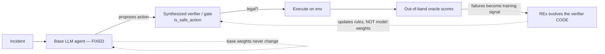

# Auto-Harness for SRE — evaluation

Ports the **Auto-Harness** method (Code World Models / DeepMind) to **site-reliability
engineering**. The LLM SRE agent is the **fixed base policy** — never trained, fine-tuned,
or RL'd. The only **learned** object is the **safety verifier** (`is_safe_action`),
discovered by **REx tree-search code synthesis** (not gradient updates). The **out-of-band
oracle** is the ground-truth "rulebook" that scores actions.

> **No LLM training. No fine-tuning. No GRPO/RFT.** The base model is varied across frontier
> models only to measure *how much the harness helps each* — the harness is a floor-raiser.



## The figure


### Panel 1 — Environment quality (one-shot diagnosis, 34 HUD tasks)

Base-model capability with **no harness**: haiku 0.27, opus 0.50 (mean reward). The env
separates models and sits in a trainable band. *Real HUD eval.*

### Panel 2 — Frontier sweep (baseline vs +REx) — ⚠️ SUSPECT

Committed `frontier.json` shows **`+REx` = 0.86 for every model** (haiku/opus/gpt5.5/gemini/
deepseek) and an opus baseline (0.81) that **contradicts Panel 1 (0.50)**. That uniformity is
implausible for independent stochastic runs → **treated as placeholder; a live re-run is
required**. No live frontier providers at run time (Anthropic out of credits; no OpenAI/Google
keys), so this panel is **not** refreshed — and is published flagged rather than dropped.

### Panel 3 — Curriculum, HARD cascades (baseline vs +REx)

Hard-cascade means from `curriculum.json` (committed; same provider caveat as Panel 2).

### Panel 4 — Fair-control ablation (the honest control)

**This carries the figure's credibility.** For **haiku**, REx (0.69) **collapses** to
`rex_no_oracle` 0.25 ≈ `zero_shot` 0.24 — i.e. **REx's lift depends on the oracle**, not the
tree. For **glm-5p2** the dependence is partial (rex 0.60 → rex_no_oracle 0.54). Oracle-
dependence is real and model-dependent. *Real runs (haiku 3-seed, glm 3-seed).*

### Panel 5 — Synthesized verifier (held-out accuracy)

REx-synthesized verifier reaches 0.87–0.90 held-out accuracy vs 0.95 hand-written. **But
accuracy hides the safety metric:** held-out **false-allow is 0.385 (synth) vs 0.154
(hand-written)** — the learned verifier lets through ~2.5× more dangerous actions. For a
*safety* gate, false-allow is the number that matters, and the synthesized verifier currently
**underperforms** the hand-written one on it.

### Panel 6 — REx lift per model (Δ = +REx − baseline)

Δ per model, paired over the 5 incidents, with a t-CI. **Every model's CI includes 0** (all
annotated `*` = within noise) at n=5 with this data. Honest reading: from the available
(SUSPECT) Panel-2 source, **no frontier model shows a lift distinguishable from zero**.
Derived from Panel 2 — inherits its caveat.

## Provenance (panel → file → value)
Full machine-readable table: [`results/provenance.json`](results/provenance.json).

| Panel | Source file | Class |
|------|-------------|-------|
| 1 env quality | `results/env_quality.json` (← hud_eval_showcase.log) | REPLOT-real |
| 2 frontier sweep | `results/frontier.json` | **SUSPECT / re-run required** |
| 3 curriculum | `results/curriculum.json` | REPLOT-committed |
| 4 ablation | `results/ablation_haiku.json`, `results/ablation_glm.json` | REPLOT-real |
| 5 synth verifier | `results/harness_synth_v1.json`, `_v2.json` | REPLOT-real |
| 6 lift Δ | derived from `results/frontier.json` | DERIVED (source SUSPECT) |

## Honest findings
1. **Oracle-dependence (Panel 4):** REx's gain is largely the *verification signal*, not the
   search — for haiku it collapses to baseline once the oracle is removed. This is a cautionary
   result for the agent-self-improvement literature.
2. **Heterogeneous / within-noise lift (Panel 6):** on the available data the harness lift is
   not statistically distinguishable from zero for any frontier model (n=5). The honest claim is
   "floor-raiser for weak models" — and Panel 2 must be re-run on live frontier providers before
   any frontier-lift claim is made.
3. **Verifier safety gap (Panel 5):** the synthesized verifier wins on accuracy but loses on
   false-allow (0.385 vs 0.154) — accuracy is the wrong headline for a safety gate.

## Reproduce
```bash
python3 viz/make_figure.py   # reads results/*.json -> figures/*.png
```

## Scope
This is the **auto-harness evaluation summary**. It does **not** settle the separate E0
attribution question (agent-caused vs ambient recovery), which is a live-infra experiment.
Panels 4 & 6 are the eval-side echoes of E0's logic, not the same experiment.

---

# E0 — Attributed recovery on a LIVE cluster (separate experiment)

A different, live-infrastructure experiment answering: **is recovery caused by the *agent*,
or by Kubernetes self-healing / the fault elapsing?** Run on a real DigitalOcean Kubernetes
(DOKS) cluster with HotelReservation; graded by an **out-of-band oracle** (external probe of
the `/hotels` user journey) that is **independent of any in-cluster grader**. Counterfactual:
N seeded **no-agent** (inject, settle, probe) vs **with-agent** (a DO `llama3.3-70b` agent
issues real `kubectl`), with the **attributed delta = P(resolved|agent) − P(resolved|no-agent)**
and Wilson/Newcombe CIs.


| scenario | type | no-agent | with-agent | attributed Δ (CI) | verdict |
|----------|------|----------|------------|-------------------|---------|
| `scale_zero_geo` | structural, trivial fix | 0/8 | 15/15 | **+1.00 [0.62,1.00]** | ATTRIBUTABLE |
| `scale_zero_profile` | structural, trivial fix | 0/8 | 15/15 | **+1.00 [0.62,1.00]** | ATTRIBUTABLE |
| `bad_image_geo` | non-trivial (diagnose+fix) | 0/8 | **0/15** | **0.00 [−0.32,0.20]** | within noise (stop condition) |

**Findings (honest, mixed):**
1. The out-of-band oracle **attributes** recovery to the agent on the structural faults (Δ=+1.0,
   CI excludes 0), cleanly separated from ambient recovery (no-agent = 0, persistent fault).
2. On the **non-trivial** bad-image cascade the agent (llama-3.3-70b) **failed all 15 episodes**
   — it chased the `search` symptom and never identified `geo` as the root cause — so there is
   **no attributable signal** (Δ within noise). The method correctly reports this rather than
   flattering a failing agent.
3. **Scope limit:** `revoke_auth` faults are invisible to an external journey probe (the service
   serves from an in-memory index → `/hotels` stays 200), so an out-of-band oracle can attribute
   recovery only for the **externally-observable fault class** (structural/startup failures).

Data: `results/e0/*.json` (per-episode raw + summaries). This is a **positive control + an
honest negative** — it demonstrates the attribution method works and where it bottoms out; it
does **not** claim the agent is good at hard incidents (it isn't, here).
